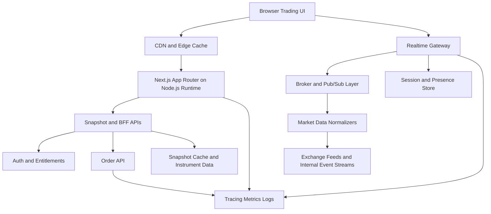
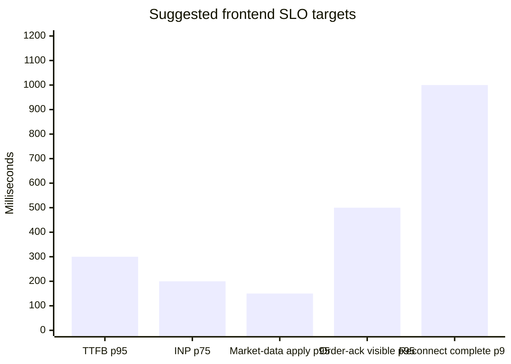
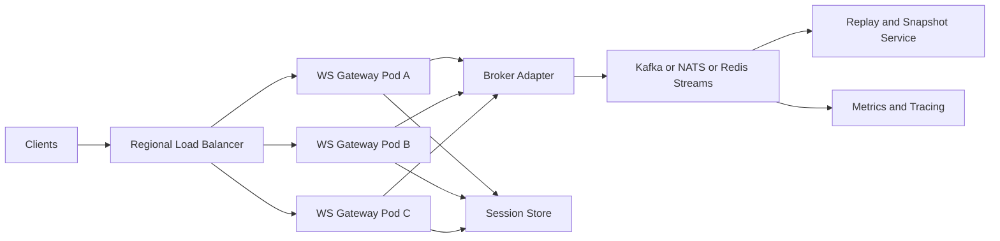

# Next.js for a Large-Scale Exchange Trading Frontend

## Executive Summary

Next.js is a strong fit for the **application shell** of an exchange trading frontend, but it should **not** be the primary runtime that fans out high-frequency market data or arbitrates ordering guarantees. Its strengths are the App Router, Server and Client Components, streaming via `<Suspense>`, cache-aware rendering, CDN friendliness, and mature React ergonomics. Those features are valuable for authenticated shells, account pages, watchlists, layouts, SEO/public content, and latency-sensitive-but-not-matching-engine-critical views. They are not, by themselves, a replacement for a dedicated real-time delivery tier, message broker, or market-data normalization pipeline. In practical terms, the best large-scale design is a **split architecture**: Next.js for page composition, routing, auth-aware server rendering, and business-UI orchestration; a separate real-time gateway for WebSocket or WebTransport fan-out; and a brokered backend for ordering, replay, and resilience.

For a trading product with unknown budget, user count, and regulatory region, the most robust default recommendation is: **Next.js App Router on the Node.js runtime**, with **Server Components by default**, **leaf-level Client Components only where interaction is required**, **streaming and Suspense boundaries for progressive rendering**, a **dedicated market-data gateway** speaking **raw WebSockets first**, a **broker layer** such as Kafka for durable ordered streams or NATS/Redis Streams for lighter-weight fan-out, a **server-state cache** such as TanStack Query or RTK Query, and a small **client-state store** such as Zustand or Redux Toolkit depending on complexity. For horizontal scale, prefer stateless HTTP pods for Next.js and a separately autoscaled connection tier behind NGINX, HAProxy, Envoy, or a managed real-time service.

The core trade-off is straightforward. If the frontend must handle **many concurrent users** and **high-throughput market updates**, then the architecture should optimize for three different things at once: **initial page load and navigation**, **steady-state event processing**, and **failure recovery**. Next.js helps most with the first category and parts of the second; it does not eliminate the need for explicit sequencing, replayable feeds, backpressure limits, transport health monitoring, or regional failover. Systems that ignore that separation often look good in early development and then break under bursty open-market traffic, reconnect storms, or cache inconsistency across pods. Next.js itself documents that default caches are per-instance unless you add a custom shared cache handler, and that Edge Runtime has material limitations including lack of ISR support.

My bottom-line recommendation is therefore:

- Use **Next.js as the frontend framework and BFF layer**, not as the market-data bus.
- Use **raw WebSockets** as the default browser transport for trading data today; evaluate **WebTransport** selectively for specialized traffic classes, not as the default first deployment. SSE is best reserved for one-way, low-frequency event channels.
- Use **TanStack Query or RTK Query** for server state, plus **Zustand or Redux Toolkit** for client interaction state; avoid forcing one library to do both jobs.
- Separate **static shell**, **real-time gateway**, **brokered stream processing**, and **order-entry APIs** into explicit tiers. That separation is what makes scaling, observability, and compliance manageable.

## Assumptions and Evaluation Criteria

Several material constraints are unspecified, and they change the optimal answer. This report therefore assumes: the project may need to support **regional growth**, **authenticated retail or pro users**, **real-time books and trades**, **order entry**, **high fan-out reads**, **strict uptime expectations**, and possibly **broker-dealer or payment-adjacent controls**. I also assume the matching engine and canonical market-data plant are separate backend systems outside the Next.js deployment. Where I recommend numerical targets later, they are **engineering SLO suggestions**, not claims that any vendor guarantees those numbers.

The architectural questions for this kind of frontend are different from a normal SaaS dashboard. The system has to optimize simultaneously for: instant shell load, robust reconnect behavior, deterministic data ordering at the UI edge, bounded memory growth under bursty feeds, graceful degradation when market-data throughput exceeds device capacity, and auditable user/session behavior. A framework choice only solves part of that problem. Protocol semantics, broker ordering rules, cache invalidation, client scheduling, and operational controls matter at least as much. WebSocket ordering is scoped to a connection, Kafka ordering is scoped to a partition, and Google Pub/Sub ordering is scoped to an ordering key; once you combine multiple upstreams, sharded fan-out, or reconnects, the frontend still needs application-level sequencing and gap handling.

For evaluation, I therefore used these criteria: rendering model suitability, real-time transport maturity, state-management fit, scaling mechanics, fault tolerance, security/compliance impact, deployment flexibility, observability, team productivity, and operating cost. That is the right lens for a long-lived trading UI, because a design that wins on developer speed but loses on reconnect storms, packet backlog, or recordkeeping obligations is usually the wrong design.

## Architectural Fit of Next.js

### Where SSR, SSG, ISR, edge rendering, and PPR actually help

Next.js supports both static and dynamic rendering models, and in the current App Router the rendering boundary is increasingly **component-level**, not strictly route-level. The documentation describes Server Components as the default for layouts and pages, with Client Components layered in only where browser APIs or interactivity are needed. Streaming works by emitting HTML in chunks aligned to `<Suspense>` boundaries, and Partial Prerendering now combines an immediate static shell with dynamic sections that stream in later. This is exactly the model you want for a trading shell: layout, navigation, account switcher, static chrome, and initial snapshot panels can render fast, while slower account state or lower-priority widgets stream in separately.

The best use of SSR in a trading app is **auth-aware first paint** and **snapshot hydration**, not continuous tick rendering. SSR is ideal for rendering the shell, preloading user entitlements, watchlists, instrument metadata, recent orders, and initial snapshot data on request. SSG is valuable for public marketing pages, help docs, asset reference pages, or exchange calendars that can tolerate build-time materialization. ISR is useful where data changes frequently but not tick-by-tick, such as instrument metadata, fee schedules, market-hours pages, and semi-static research content. Next.js explicitly states that static generation happens at build time and SSR happens on each request; ISR updates static content without rebuilding the whole site.

Edge rendering is attractive for auth checks, geo-sensitive redirects, or lightweight personalization near the user, but it is not a blanket recommendation for exchange UIs. The Edge Runtime uses a limited API set, does not support all Node.js APIs, and does not support ISR. That means real production trading apps should treat edge execution as a **specialized tool**, not the universal host for all route logic. If your data access layer, crypto, broker SDKs, or observability packages rely on Node APIs, the Node.js runtime remains the safer default.

A particularly important operational point is caching. Next.js documents that, in multi-instance deployments, default caches are isolated per process and that revalidation is local unless you provide distributed coordination through a custom cache handler. It also states that a shared custom cache handler can keep cache behavior consistent across pods and can store cache state externally, such as in Redis or S3. For a large-scale trading frontend running behind a load balancer, that is not an optimization; it is table stakes. Without it, different users can get different freshness behavior depending on which pod answered them.

### Recommended separation of concerns

The most important architectural decision is to keep **page rendering** and **real-time feed transport** separate. Next.js should handle the shell, routing, RSC-driven data composition, authenticated server actions where appropriate, and snapshot APIs. A dedicated real-time gateway should ingest normalized market data and fan it out to browsers. Orders should go through a separate low-latency order-entry API, typically over HTTPS for request/response semantics, while market-data subscriptions remain on persistent channels. This split lets you scale HTTP rendering, socket fan-out, and order APIs independently, which is essential once workloads diverge. That recommendation is an inference from the documented rendering/caching model of Next.js and the scaling characteristics of real-time protocols and brokers.

This diagram reflects the recommended split because Next.js is excellent at orchestrating the first request, the shell, and snapshot composition, while the real-time gateway and broker layer own sequencing, fan-out, replay, and reconnection semantics. Next.js streaming and component-level rendering make it especially good at delivering the shell progressively; Kafka, Pub/Sub, Redis Streams, or similar systems are what give durable fan-out and message-order discipline to the real-time side.

## Real-Time Data and State Strategy

### Transport choice

For a trading frontend in 2026, **WebSocket remains the default transport choice**. RFC 6455 defines an ordered, bidirectional protocol over TCP, and message fragments must be delivered in sender order. That makes WebSocket a stable default for top-of-book, level-two deltas, fills, notifications, and account events. WebTransport is promising because it provides reliable streams and unreliable datagrams on HTTP/3/QUIC, which can be useful for separating traffic classes and avoiding unnecessary head-of-line coupling between independent streams. SSE, via `EventSource`, is one-way and text-based, which makes it simple and operationally friendly for announcements or low-frequency one-way updates, but not ideal for interactive trading traffic or binary-heavy streams.

| Transport | Best fit in a trading frontend | Strengths | Limitations | Practical recommendation |
|---|---|---|---|---|
| WebSocket | Market data, order status, fills, account events | Full duplex; mature tooling; ordered delivery on a connection; broad ecosystem support. | One ordered stream can couple unrelated traffic; app-level backpressure and replay are still your problem. | **Default choice** for first production release. |
| WebTransport | Specialized feeds, independent channels, mixed reliable/unreliable traffic | Reliable ordered streams plus datagrams over HTTP/3/QUIC; multiple stream types in one session. | Newer operational model; less ubiquitous infrastructure experience than WebSocket. | Evaluate for advanced use cases, not the default broad rollout. |
| SSE | Notifications, banners, low-frequency one-way events | Very simple; standard HTTP semantics; `EventSource` is widely available. | One-way only; text/event-stream; not suited for interactive order flow. | Good secondary channel for non-critical one-way streams. |

A useful refinement is to run **different data classes over different channels**, even if they all use WebSocket. For example: one connection for market data, one for account/order events, and one fallback or auxiliary SSE channel for operational notices. The reason is not just performance; it is fault isolation. If the market-data lane floods, the account-event lane should remain healthy. WebTransport can formalize that separation with stream primitives, but you can get most of the benefit today by being deliberate about socket partitioning and UI prioritization. This is an architectural inference supported by the protocol capabilities and by the way React hydration benefits from smaller, independent work units.

### Pub/sub and broker patterns

At scale, the browser transport is only the outer layer. The harder problem is how feeds are normalized, ordered, replayed, and redistributed internally. Kafka remains the strongest default for durable, replayable, high-throughput streams because it provides durable topics, exactly-once processing support, and deterministic ordering **within a partition**. Google Pub/Sub offers optional ordering keys, but ordering and throughput are scoped per key. Redis Streams supports consumer groups and works well for lighter-weight stream processing and fan-out coordination, while NATS JetStream adds stream persistence, deduplication support, and ordered consumption options with lower operational weight than Kafka in many cases.

For an exchange frontend, the right pattern is usually: **broker-backed normalization and sequencing upstream, ephemeral socket fan-out downstream**. That means the frontends do not treat WebSocket as the source of truth. They treat it as a delivery mechanism for a stream that already has sequence numbers, replay windows, and clear gap semantics. If a tab misses sequence `N+1`, it does not "hope the next delta fixes things"; it requests a refetch or replay window. That recommendation follows directly from broker ordering scopes and from the fact that WebSocket gives in-order delivery inside a connection, but not cross-connection or cross-shard truth by itself.

### State-management model

The most reliable way to structure state in a trading frontend is to separate it into three categories: **server state**, **client interaction state**, and **streaming session state**. TanStack Query, SWR, and RTK Query were built to manage server state—fetching, caching, revalidation, retries, deduplication, mutation workflows. Redux Toolkit and Zustand are better thought of as client-state tools, although RTK Query extends Redux into server-state territory. Recoil can model derived dependency graphs elegantly, but for a mission-critical trading UI it is usually less attractive than the more operationally mainstream combinations of TanStack Query plus Zustand, or Redux Toolkit plus RTK Query. That last point is partly a market-read inference, so I treat it as a recommendation rather than a hard fact.

| Library | Primary role | Strengths for trading UIs | Weaknesses / caution | Best use |
|---|---|---|---|---|
| TanStack Query | Server state | Rich cache lifecycle, retries, mutations, prefetching, cancellation, Suspense support. | Not a full client-state store by itself. | Snapshot data, account data, order history, hydrations from SSR. |
| SWR | Lightweight server state | Minimal API, caching, revalidation, request dedupe. | Less opinionated power than TanStack Query for complex workflows. | Simpler read-heavy views or lower-complexity apps. |
| RTK Query | Server state inside Redux | Purpose-built data fetching and caching within Redux Toolkit. | Pulls you into Redux architecture if you were not already there. | Teams standardizing on Redux and needing integrated data cache. |
| Zustand | Client interaction state | Small, fast, scalable hook-based store with little boilerplate. | You must impose structure and discipline yourself. | UI preferences, panel layout, hotkeys, ephemeral session state. |
| Redux Toolkit | Complex client state | Predictable centralized state, good testability, mature patterns. | More ceremony than Zustand for local UI concerns. | Large multi-team products with complex workflows and auditability needs. |
| Recoil | Derived client state graph | Atoms/selectors can express derived state elegantly. | Less compelling than the mainstream pairs above for greenfield exchange apps. | Niche use only if your team already has deep familiarity. |

The cleanest default stack for this class of product is therefore one of two blends:

**Option A:** TanStack Query for server state + Zustand for local UI state + stream reducers for order books and ticks. This is the simplest high-performance combination for many teams.

**Option B:** Redux Toolkit + RTK Query when you have many teams, stricter workflow/state conventions, and a real need for centralized orchestration. Redux's emphasis on predictability and testability is still valuable in high-stakes UIs.

### Data consistency, ordering, and UI mutation rules

The frontend should assume that **market data is eventually stale**, **order state is causally sensitive**, and **render order is not the same as business order**. A sound design keeps local order books as sequence-aware structures, tags every delta with exchange sequence or normalized sequence, and refuses to apply deltas that arrive after a detected gap without recovery. Because Kafka only guarantees ordering within a partition, Pub/Sub only within an ordering key, and socket delivery only within a connection, explicit sequence tracking at the application layer is non-negotiable.

The UI should also distinguish between **optimistic interaction state** and **authoritative exchange state**. Clicking "Cancel order" can optimistically disable the button and mark the row as "cancel pending," but final order status should only be committed from the authoritative acknowledgment event path. This is precisely the kind of split where server-state libraries and a small client-state store complement each other: one manages remote truth; the other manages local intent and temporary UX state.

## Performance, Concurrency, and Resilience

### Rendering performance inside the browser

Next.js and React give you powerful primitives, but the default failure mode in a trading UI is still **too much client JavaScript and too much client-side rendering**. Next.js documents that once a file is marked `"use client"`, all of its imports and children in that module graph join the client bundle. It also explicitly recommends limiting Client Components to the minimal interactive boundary to reduce bundle size. That is critical for trading workstations, where you want the shell to paint quickly and keep the main thread free for interaction while real-time updates are arriving.

Streaming and selective hydration matter more here than in a normal content app. Next.js streaming emits progressive HTML chunks aligned to Suspense boundaries, and the docs explain that each `<Suspense>` boundary becomes a hydration unit. Without those boundaries, React hydrates the entire page in one blocking pass; with them, hydration breaks into smaller tasks that yield to the browser. That is extremely relevant for complex dashboards with watchlists, charts, order tickets, blotters, and news modules competing for CPU.

For high-density views such as order books, fills, or history tables, use **virtualization/windowing**. The web.dev guidance on `react-window` remains directly applicable: render only the visible rows, not thousands of DOM elements. Memoization also matters, but it should be surgical. React's `useMemo` is for caching expensive calculations, not as a blanket policy. In practice, virtualization, coarse-grained store subscriptions, stable selectors, and animation throttling usually pay off more than indiscriminate memo wrapping.

A reasonable target profile for the browser layer is shown below. These are **recommended SLOs for engineering**, not vendor guarantees:

Those targets are deliberately split across page-load performance and trading-task performance. For page UX, align with Core Web Vitals guidance: LCP at or under 2.5s, INP at or under 200ms, CLS at or under 0.1, measured at the 75th percentile. For trading interactions, add workload-specific metrics on top: **time from feed ingress to DOM commit**, **time from order submit to user-visible acknowledgment**, **sequence-gap rate**, and **reconnect recovery time**. Next.js exposes `useReportWebVitals` for browser reporting, and its instrumentation hook plus OpenTelemetry are appropriate for end-to-end telemetry.

### Horizontal scaling and connection fan-out

HTTP rendering scale and persistent-connection scale are different problems. Kubernetes, ELB/Ingress, and CDN caches help with stateless HTTP traffic. Persistent connections need connection-aware gateways, tuned timeouts, memory discipline, and usually a broker or adapter behind them. Kubernetes documents Ingress as the entry point for HTTP/HTTPS routing into services; on EKS, AWS Load Balancer Controller manages ALB/NLB resources. NGINX, HAProxy, and Envoy all support WebSocket proxying or upgrades, but each has its own operational caveats.

NGINX supports WebSocket proxying through HTTP/1.1 upgrade tunneling. HAProxy's documentation notes that very little is needed beyond timeout handling because the load balancer understands the upgrade and tunnels traffic after that point. Envoy supports WebSocket upgrades too, but its documentation cautions that buffering is generally incompatible with upgrades—an important subtlety for production configs. Those differences matter because the wrong buffering, idle timeout, or keepalive setting can destroy an otherwise-correct design during volatile traffic.

The decision on **sticky sessions** depends on your transport stack. Pure raw WebSocket connections become pinned to the backend that accepted them for the life of the connection, so long-lived affinity is less important once connected. But if you use Socket.IO with HTTP long-polling fallback, sticky sessions matter because multiple HTTP requests can belong to the same logical session. Socket.IO's docs explicitly say sticky sessions are required in multi-node deployments, and even the Redis Streams adapter still requires them when the session protocol depends on that model.

On implementation choices: Socket.IO's Redis adapter uses Redis Pub/Sub to broadcast packets across nodes, while the Redis Streams adapter improves resilience to temporary Redis disconnections and can resume without losing packets. Both are useful, but for an exchange frontend I would only choose Socket.IO if I truly need its reconnection semantics and ecosystem. If the product can standardize on raw WebSocket, a thinner gateway typically gives lower overhead and less protocol complexity. uWebSockets.js markets itself as a very high-performance server and appears near the top of public TechEmpower web benchmarks, but those benchmarks should be treated as directional, not as proof that your market-data workload will behave the same way.

Managed services can be compelling if you prioritize time-to-market. AWS API Gateway WebSocket APIs have explicit quotas such as **500 new connections per second per account per region**, **2-hour maximum connection duration**, and **10-minute idle timeout**; that makes them useful, but not automatically ideal for very large exchange-style connection churn without careful design. Azure Web PubSub is explicitly positioned as a managed WebSocket/pub-sub service, and Microsoft documentation states a single resource can scale to **1 million concurrent connections** in many cases. Cloudflare Durable Objects can coordinate stateful WebSocket groups and connect **thousands of clients per instance**, with hibernation support to reduce cost during idle periods. Vercel documentation now states that frameworks with native WebSocket support can serve WebSocket connections on Vercel Functions when Fluid compute is enabled.

### Backpressure, load shedding, and graceful failure

Backpressure is not optional in this stack. The browser exposes `WebSocket.bufferedAmount`, which tells you how many bytes have been queued but not yet transmitted. Node's stream system likewise documents explicit backpressure behavior via return values and `'drain'` events. In other words, both browser and server runtimes already expose the signal you need to prevent unbounded queue growth; your application has to use it.

For a trading UI, that usually means **tiered degradation**. When a client falls behind, first compress or coalesce non-critical updates; then drop low-priority channels such as depth beyond a configured cutoff or cosmetic indicators; then force a snapshot refresh rather than replaying an unbounded delta backlog. The correct policy is domain-specific, but the principle is universal: preserve correctness first, then preserve interactivity, and only then preserve richness. This recommendation is an inference from the documented backpressure primitives and ordering constraints above.

## Security, Compliance, and Operational Controls

Authentication and authorization for a trading frontend should be based on **OIDC on top of OAuth 2.x**, using the **Authorization Code flow with PKCE** for browser-based applications. PKCE exists specifically to mitigate authorization-code interception attacks, and current browser-app guidance recommends Authorization Code + PKCE over the old implicit flow. OIDC then adds a standardized identity layer over OAuth so the frontend can verify the authenticated user and receive interoperable identity claims. MFA should be a default control, not a premium feature; FINRA's own security guidance emphasizes MFA, and its oversight reports identify the absence of MFA as a cybersecurity weakness.

For transport security, all external traffic should be TLS-protected, including `wss://` WebSocket connections. If you use Redis-based socket adapters, do not assume the adapter provides integrity or confidentiality: the Socket.IO Redis Streams adapter documentation explicitly states that inter-server messages are not signed, encrypted, or authenticated by the adapter and that Redis should be protected with ACLs, TLS, private networking, and least-privilege credentials. That is an important reminder that "internal pub/sub" still carries real security risk.

On compliance, two issues matter most here. First, if the product touches payment-account environments, PCI DSS applies baseline technical and operational controls for systems that store, process, or transmit payment account data. Second, broker-dealer and many securities workflows have books-and-records obligations: FINRA Rule 4511 requires firms to make and preserve required books and records, with at least six years of retention where no other retention period is specified, and it ties into Exchange Act requirements and Rule 17a-4 format obligations. If the business operates regulated market infrastructure, SEC Regulation SCI may also become relevant because it imposes systems-compliance and resiliency obligations on certain exchanges, ATSs, clearing agencies, and related entities.

Operational security controls should include rate limiting at the CDN/load-balancer and gateway layers, per-user and per-IP submit throttles, strict origin checks for browser socket endpoints, short-lived access tokens, revocation-aware session handling, content security policy, and aggressive secrets isolation. The exact control set depends on your regulator and risk model, but the principle does not: a trading frontend is a privileged surface, not just a render target.

### Testing and observability

For end-to-end testing, Playwright is a strong default because it drives Chromium, Firefox, and WebKit with an isolated test runner and resilient locator model. For load tests, k6 supports WebSocket testing and recommends its standards-aligned `k6/websockets` module for new tests. For tracing, metrics, and logs, OpenTelemetry remains the best vendor-neutral baseline, and Next.js provides an `instrumentation.js|ts` hook specifically for integrating observability tools. For latency SLOs, Prometheus histograms remain the standard way to compute percentiles and enforce latency SLIs.

I recommend six observability layers for this product: browser RUM, Next.js render traces, real-time gateway metrics, broker lag metrics, order-API tracing, and business-event audit logs. At minimum, measure Web Vitals, feed-ingress-to-DOM latency, message drop/gap counts, reconnect success rate, cold-start or route-render time, broker lag, and order-submit-to-ack timings. Chaos exercises should explicitly test gateway restarts, Redis/Kafka interruption, stale cache invalidation, and region failover. Managed resilience testing tools such as Azure Chaos Studio exist to inject controlled faults and validate recovery.

## Deployment, Developer Experience, Cost, and Recommended Stack Options

### Hosting and infrastructure trade-offs

There is no single best hosting answer; the right platform depends on whether you optimize for **time-to-market**, **global edge reach**, or **maximum control over persistent connections**. The key point is that the **Next.js hosting choice and the real-time hosting choice do not have to be the same**. In fact, large systems often do better when they are different. Next.js pages can live on a platform optimized for caching and streaming, while socket gateways live on Kubernetes, VMs, or a managed pub/sub service. Next.js itself sets `Cache-Control` headers that CDNs can use, and major platforms such as Vercel, Cloud CDN, and Cloudflare all expose explicit caching layers.

| Hosting pattern | Strengths | Weaknesses | Best fit |
|---|---|---|---|
| **Vercel for Next.js + separate realtime service** | Excellent fit for Next.js streaming/CDN workflows; Vercel supports Next.js deeply and documents WebSocket support with Fluid compute. | Realtime still deserves separate scale/error-budget planning; platform abstraction can limit low-level tuning. | Teams prioritizing delivery speed and CDN performance. |
| **Self-hosted Next.js on Kubernetes + dedicated gateway tier** | Maximum control over pods, cache handlers, broker locality, ingress, and autoscaling. Kubernetes is built for deployment and scaling of containerized apps. | Highest operational burden; you own more of the failure modes. | Large teams, strict infra control, heavy connection footprints. |
| **Cloudflare edge shell + Durable Objects for coordination** | Strong global edge model; Durable Objects can coordinate thousands of clients per instance and support WebSocket hibernation. | Different programming/runtime model; not every Node-centric package fits cleanly. | Geo-distributed realtime collaboration or edge-heavy fan-out designs. |
| **Managed realtime service with independent Next.js host** | Fastest path to large connection counts; Azure Web PubSub is designed for real-time pub/sub and Microsoft documents very large concurrent-connection scale. | Ongoing service cost; sometimes less protocol/control flexibility than self-hosted gateways. | Teams that want to outsource connection management early. |

My recommendation under uncertainty is a **hybrid platform**: host the Next.js app on the platform that best serves your CI/CD and CDN model, but run market-data gateways independently. That keeps the UI framework choice from over-determining the socket architecture.

### Code organization and team topology

For a large codebase, a monorepo is usually the right answer. Nx positions itself as a build system with smart caching and orchestration for monorepos and polyrepos; Turborepo is a Rust-based build system designed for JavaScript/TypeScript monorepos with remote caching. Both are good choices. If the organization is heavily Next.js and Vercel-centric, Turborepo is the more natural default; if the monorepo will span more tooling, languages, or advanced graph-aware CI, Nx is compelling.

A shared component library is also worth the upfront effort. Storybook is explicitly designed for building, testing, and documenting UI components in isolation, which is unusually valuable for trading displays because edge cases and visual states are numerous and expensive to reproduce inside the live app. Build your order-ticket components, price ladders, status badges, error banners, and permission-based variants there first.

Microfrontends should be approached conservatively. Module Federation is real and useful, and it lets multiple JavaScript applications share code at runtime. But in a latency-sensitive trading surface, widget-level federation often increases bundle complexity, integration latency, and debugging cost. If you use microfrontends, keep them **coarse-grained and route-bounded**—for example, separating admin/back-office from trader workspaces—not as dozens of independently deployed tiles on one critical dashboard. The caution there is an engineering recommendation supported by the architectural nature of Module Federation rather than a direct vendor claim.

### Cost considerations and recommended stack options

Managed services usually win on **speed of launch** and **operational simplicity**, while self-hosted Kubernetes tends to win only after you have the scale, team, and operational maturity to justify it. Azure Web PubSub advertises flexible per-hour billing, GKE has explicit per-cluster pricing in addition to workload cost, and Vercel meters platform resources through its own pricing model. Those models all make one thing clear: connection-heavy realtime workloads, high egress, and globally replicated caches are where costs accumulate fastest.

I would frame the viable stack choices like this:

**Recommended default stack for most teams**
- Next.js App Router on Node.js runtime
- TanStack Query + Zustand
- Raw WebSocket gateway
- Kafka for core durable event streams; Redis for local cache/session concerns
- Kubernetes for gateways, any strong Next.js host for the shell
- OpenTelemetry + Prometheus + centralized logs
- Playwright + k6 in CI and pre-prod.

**Lower-ops managed stack**
- Next.js on Vercel
- TanStack Query + Zustand
- Managed realtime service such as Azure Web PubSub or Cloudflare Durable Objects
- Redis for transient app coordination
- Vercel/OTel/browser RUM for observability.

**Highly governed enterprise stack**
- Self-hosted Next.js and gateways on Kubernetes
- Redux Toolkit + RTK Query
- Kafka core bus, Envoy or HAProxy ingress tier
- Shared custom Next.js cache handler
- Strong audit/retention/logging pipeline aligned to regulatory obligations.

## Migration Strategy and Phased Roadmap

A small app should not start with every large-scale feature turned on. It should start with the **same architectural boundaries** it will need later, even if some of them are thin or lightly provisioned at first. The biggest migration mistake is building the entire product as "just Next.js plus a single socket server" and only later trying to carve out ordering, gateway, cache, and replay boundaries after clients depend on the original shape. Next.js and React make incremental migration easy at the rendering layer, but they do not make infrastructure boundary mistakes disappear.

| Phase | Scope | Key milestones | Main risks | Exit criteria |
|---|---|---|---|---|
| **Foundation** | Shell, auth, snapshots, basic watchlist | Next.js App Router, Server Components by default, minimal Client Components, RUM and tracing enabled. | Overusing client rendering, weak observability. | Stable auth-aware shell; Core Web Vitals instrumented. |
| **Realtime MVP** | Single region, modest concurrency | Dedicated WebSocket gateway; sequence-aware market-data model; TanStack Query or RTK Query integrated with snapshots. | No gap recovery, no feed prioritization. | Reconnect+resync works; gap detection tested. |
| **Scale-out** | Multi-pod, burst handling | Shared cache handler for Next.js; broker-backed fan-out; ingress/proxy hardening; load tests with k6. | Pod inconsistency, reconnect storms, buffer growth. | Horizontal scale proven under representative load. |
| **Reliability** | Failure injection and replay | Chaos experiments; replay windows; snapshot refresh paths; browser-side degradation rules. | Hidden failover bugs, unbounded backlog. | Controlled failure tests pass with acceptable recovery. |
| **Regulated hardening** | Audit, retention, controls | MFA, token hardening, immutable logs/retention workflows, books-and-records mapping. | Retroactive compliance redesign. | Security review and retention controls implemented. |

The migration path from "small app" to "large exchange frontend" should usually look like this in prose:

Start with a **single Next.js app plus a separate realtime gateway**, even if both are tiny. Use snapshots for initial load and sockets for updates from day one. Add explicit message sequencing immediately. Once growth begins, move caches to shared storage, introduce a durable broker, and decouple feed normalization from fan-out. Only after those boundaries are in place should you optimize regional topology, edge placement, or transport diversification. That sequence minimizes rewrites because every later scale step extends an existing boundary instead of inventing one under pressure.

The main risks by phase are also predictable. Early on, it is easy to build too much as Client Components and lose control of bundle size. In the middle phase, the danger is believing connection count is the same thing as throughput capacity; it is not. Later, the danger is assuming broker ordering or WebSocket ordering alone is sufficient for correctness in a distributed, reconnecting UI. Finally, in regulated environments, the expensive mistake is postponing audit logging and retention design until after the product shape has already solidified.

### Final recommendation

If I were choosing for a new large-scale exchange frontend today, I would choose **Next.js App Router** for the web application layer, but I would pair it with a deliberately independent real-time architecture. That gives you the best of both worlds: modern React rendering, strong DX, component-level caching and streaming, and excellent page performance on one side; explicit throughput engineering, broker-backed ordering, and connection-scale control on the other. In other words, **use Next.js aggressively for UI composition, but use it conservatively for the realtime core**. That is the architecture most likely to survive the transition from pilot to production.
